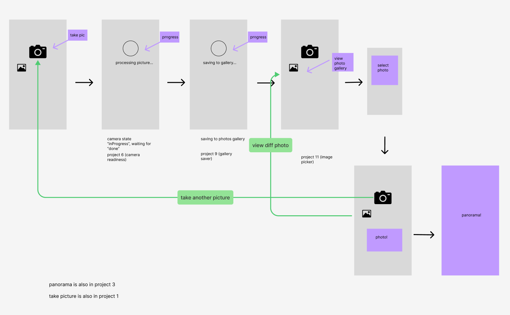
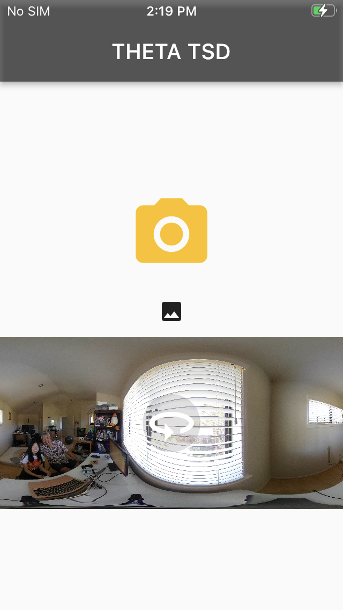
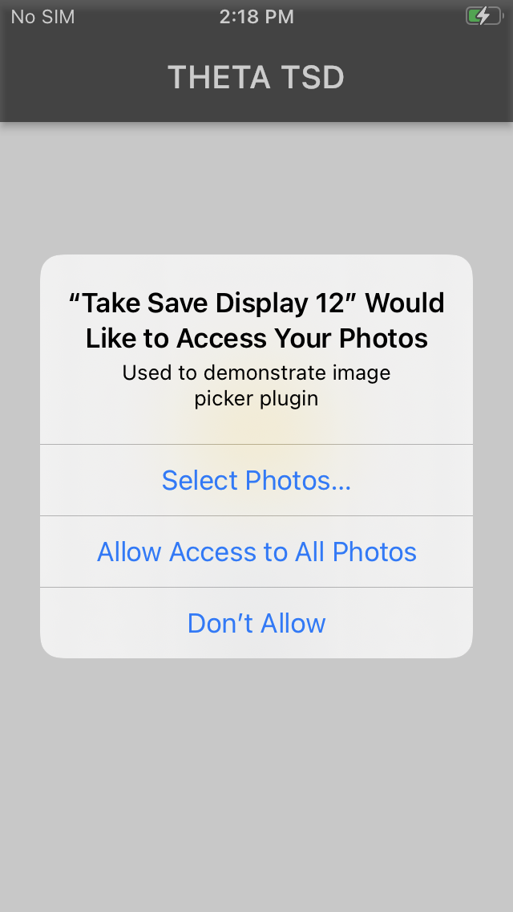
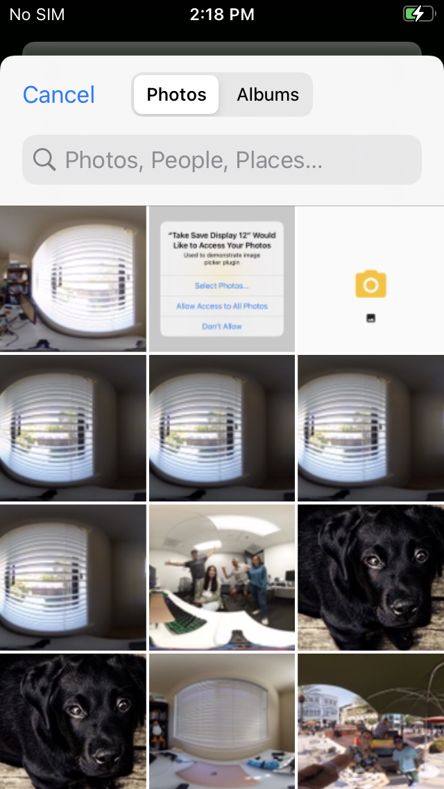

# 12. Take Save Display 

A demonstration of using the RICOH THETA X camera with Android and IOS phones.

## Features

* Take a picture 
* Save image to gallery
* Select image from gallery & display
* View image in 360 view



## Resources

This application is built on the tutorials below.

* [THETA Concept 3](https://starter.theta360.guide/03-ricoh-theta-api-app-state-management-with-bloc/) (taking picture with Bloc management)
* [THETA Concept 6](https://starter.theta360.guide/06-api-commands-in-sequence/) (checking camera state before moving on)
* THETA Concept 9 (saving image to gallery)
* THETA Concept 11 (selecting image from gallery)




## Key Flutter Packages 

* panorama - view 360 image with navigation
* image_picker - select image from gallery
* gallery_saver - save image to gallery
* flutter_bloc - manage state 

## View Image in 360

This project uses the panorama package to view the image in 360 view. When the user clicks on the image, the `Navigator.push` displays it in full screen.  

```dart
class PanoramaScreen extends StatefulWidget {
  File myFile;
  PanoramaScreen({Key? key, required this.myFile}) : super(key: key);

  @override
  State<PanoramaScreen> createState() => _PanoramaScreenState();
}

class _PanoramaScreenState extends State<PanoramaScreen> {
  @override
  Widget build(BuildContext context) {
    return Scaffold(
        appBar: AppBar(),
        body: Center(
          child: Panorama(child: Image.file(widget.myFile)),
        ));
  }
}
```

## Taking Picture

Refer to [Tutorial 6. Multiple RICOH THETA API Commands in Sequence](https://starter.theta360.guide/06-api-commands-in-sequence/) for more description of the process. 

The project executes the command `camera.takePicture` from the [RICOH THETA API](https://api.ricoh/docs/theta-web-api-v2.1/getting_started/). It continously checks to see if the takePicture process is `done` with `commands/status`. When the image is finished processing, the project moves on to the next step: saving the image to the gallery.

```dart
 on<PictureEvent>((event, emit) async {
      var url = Uri.parse('http://192.168.1.1/osc/commands/execute');
      var header = {'Content-Type': 'application/json;charset=utf-8'};
      var bodyMap = {'name': 'camera.takePicture'};
      var bodyJson = jsonEncode(bodyMap);
      var response = await http.post(url, headers: header, body: bodyJson);
      var convertResponse = jsonDecode(response.body);
      var id = convertResponse['id'];

      if (convertResponse != null && id != null) {
        emit(ThetaState(message: response.body, id: id));
        while (state.cameraState != "done") {
          add(CameraStatusEvent());
          await Future.delayed(Duration(milliseconds: 200));
          print(state.cameraState);
        }
      }
      add(GetFileEvent());
    });
```

## Saving Image to Gallery

The `GetFileEvent` retrieves the last file url from the camera with `camera.listFiles`. It parses out the url from the response and updates the State with the file url.

```dart
on<GetFileEvent>((event, emit) async {
    ...
 var fileUrl = convertResponse['results']['entries'][0]['fileUrl'];
      emit(state.copyWith(fileUrl: fileUrl));
...
} 
```

Import the [gallery_saver](https://pub.dev/packages/gallery_saver) package to the project and add permission in the `AndroidManifest.xml` file.

```dart
android.permission.WRITE_EXTERNAL_STORAGE
```

Save the image with `GallerySaver.saveImage` inside of the `SaveFileEvent` and notify the State that the image is finished saving.

```dart
 on<SaveFileEvent>((event, emit) async {
      await GallerySaver.saveImage(state.fileUrl).then((value) {
        emit(state.copyWith(finishedSaving: true));
      });
    });
```

## Selecting Image from Gallery

This section of the application follows the tutorial by [Learn Flutter with Smirty](https://github.com/hprity60/multi-image-picker-bloc-8).

### theta_event.dart

```dart
...
class ImagePickerEvent extends ThetaEvent {
  final XFile image;

  ImagePickerEvent(this.image);
}
```

### theta_bloc.dart

```dart
 on<ImagePickerEvent>((event, emit) async {
      emit(state.copyWith(images: event.image));
    });
```

### main.dart

```dart
 IconButton(
    onPressed: () async {
        final image = await ImagePicker().pickImage(
        source: ImageSource.gallery,
        );
        if (image == null) return;
        context
            .read<ThetaBloc>()
            .add(ImagePickerEvent(image));
    },
    icon: Icon(Icons.image)),
```

When the `IconButton` is pressed, it adds the `ImagePickerEvent` with the file from `ImagePicker`. Inside the Bloc file, the `ImagePickerEvent` updates the State with the file.





## Bloc Structure

This project uses the [flutter_bloc](https://pub.dev/packages/flutter_bloc) package to handle State management. Events are associated with every action that occurs. The State holds information in parameters and the main constructor. In the Bloc file, there are `on` methods that handle when every Event is called. 

Example of the State constructor:

```dart
class ThetaState extends Equatable {
  final String message;
  final String fileUrl;
  final String cameraState;
  final String id;
  final bool finishedSaving;
  final XFile? images;

  ThetaState(
      {required this.message,
      this.fileUrl = "",
      this.cameraState = "initial",
      this.id = "",
      this.finishedSaving = false,
      this.images});}
```